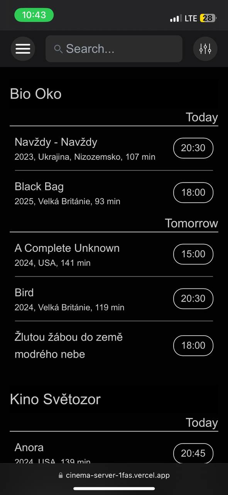

https://cinema-server-1fas.vercel.app/

Web application that you can use to search film screenings in Prague.

Here you can:

1. filter your screenings:
   1. search for the movie title
   1. select the date range
   1. show only screenings with English subtitles if you don't know Czech 😉
   1. select and save you favorite cinemas
1. save the screenings to the watchlist
1. save them to your favorite calendar: Apple or Google

... and more feature are coming 🥹

Right now we fully support only the mobile version so sorry desktop users \(\(

Here is how it looks:

\*The data is fully taken from [CSFD](https://www.csfd.cz/) and this project is yet for my personal use only
